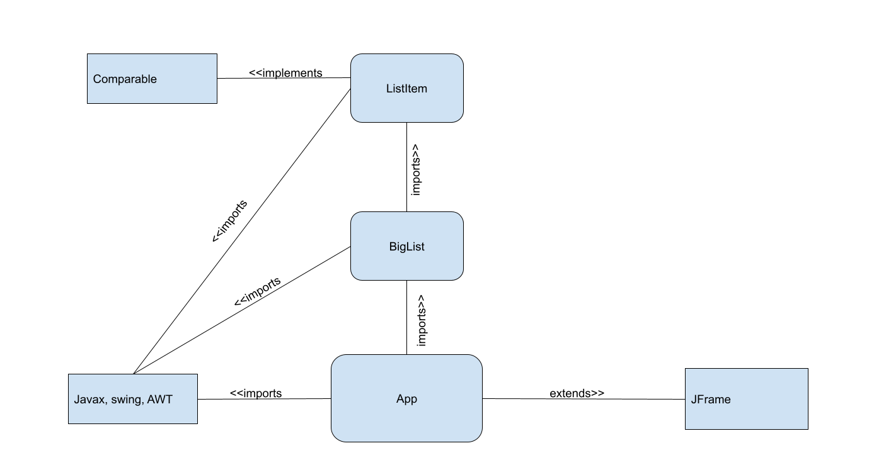

# Idea- User-created Lists

## Pull up list

[button: BACK]
|Task Name  | Description (editable)   |  Checkbox (finished)| Buttons
|---|---|---|---|
|Eat  | consume | Y | Delete/Edit
|Walk Home  |I will walk home  |N |  Delete/Edit

[Save button] [Delete All]

## Default view

[input filename] [button: OPEN]

## Components

### Backend

- BigList (ListItem[])
  - delete, add, save to file, read from Scanner, edit individual elements
  - Getters/Setters, parse, toComponent, sort
- ListItem implements Comparable\<ListItem>
  - Name, Description, IsDone
  - Getters/setters, toComponent, compareTo (sort by name)
  
### Frontend

- App
  - default view toggle (back button)
  - main method (build app)
  - On default view
    - getFileFromInput
  - On list view
    - saveCurrentList
    - editListItem

## UML Diagram (Classes)

## Responsibilites

BigList Class- Tk

ListItem Class- Jake

App - Percy

### consequences!??!?

Warnings up to 3

- Get it done
- Really get it done
- Get it done.

After the 3 warnings are used up, report the issue up to Padjen.  

visit willnothackyou.com to get it renewed
death [guillotine]/getting yelled at by teammates
